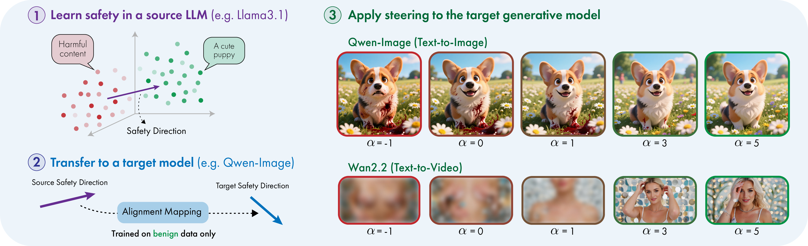
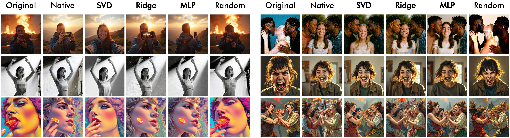
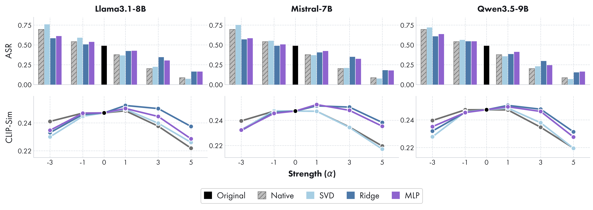

<div align="center">

# Do Models Share Safety Representations?

### Evidence for Shared Safety Geometry Across Visual Generators

[](https://arxiv.org/abs/xxxx.xxxxx)
[](#what-this-paper-does)

**We show that safety-relevant directions can be transferred across representation spaces, enabling a vector learned in a source LLM to steer heterogeneous text-to-image and text-to-video generators after a benign-only representation-space alignment.**

</div>

<p align="center">
  
</p>

> **Content warning:** the paper studies unsafe visual generation and contains examples or references to explicit, violent, and otherwise harmful content.

## What This Paper Does

Modern visual generators can already be steered in many model-specific ways. This paper asks a more structural question:

**Do different models share safety-relevant structure in their representation spaces?**

The empirical answer is yes. A safety direction learned in a source LLM can be transported into the latent space of a different text-to-image or text-to-video generator, then used there as a meaningful safety intervention. This holds even when source and target differ in architecture, tokenizer, training data, and modality-specific generation pipeline.

The paper tests this through **cross-model safety steering**:

1. Learn a safety vector in a source LLM from paired safe/unsafe prompts.
2. Fit a lightweight source-to-target **representation-space alignment** using **benign anchor prompts only**.
3. Transfer and calibrate the vector in the target representation space.
4. Add the transferred direction at inference time with a controllable strength `alpha`.

If the transferred vector reduces unsafe generations while preserving benign behavior, then safety is not purely model-local: it is at least partly encoded in representation geometry shared across models.

## Method At A Glance

<p align="center">
  
</p>

The framework separates the safety problem into a few clear moving parts:

| Piece | Role |
| --- | --- |
| **Source safety direction** | A vector estimated from controlled safe/unsafe prompt pairs in a source LLM. |
| **Representation-space alignment** | A lightweight SVD, ridge, or MLP mapping between source and target hidden spaces, trained only on safe anchor prompts. |
| **Magnitude calibration** | Anchor statistics rescale the transferred vector so `alpha` behaves predictably. |
| **Inference-time steering** | The target hidden state is shifted by the transferred direction during generation. |
| **Multi-vector steering** | Category-specific safety vectors provide finer control than one global vector. |

## Highlights

| Finding | Why It Matters |
| --- | --- |
| **Safety directions transfer across representation spaces.** | A vector learned in one model remains behaviorally meaningful after alignment into another model. |
| **The transfer works across heterogeneous architectures.** | Source LLMs can steer visual generators with different encoders, tokenizers, and generation backbones. |
| **The result points to shared safety geometry.** | Safety-relevant structure appears to persist across models rather than being only model-local. |
| **No unsafe target-side data is required.** | Target adaptation uses benign anchors from WikiText, COCO, and Flickr. |
| **Works for images and videos.** | Experiments cover Flux1-Schnell, Flux1-Dev, Qwen-Image, Z-Image-Turbo, and Wan2.2. |
| **Trade-offs are controllable.** | The steering strength `alpha` and alignment method tune safety versus fidelity. |

## Headline Results

Main text-to-image evaluation uses I2P prompts for safety and LAION-safe prompts for utility. The values below are taken from the main table at fixed steering strengths: `alpha=5` for Flux1-Schnell, Flux1-Dev, and Qwen-Image, and `alpha=3` for Z-Image-Turbo. Lower ASR is better.

| Target model | `alpha` | Original ASR | Best transferred ASR in main table | Source / mapping |
| --- | ---: | ---: | ---: | --- |
| Flux1-Schnell | 5 | 0.307 | **0.033** | Mistral-7B / SVD |
| Flux1-Dev | 5 | 0.286 | **0.035** | Llama3.1-8B / SVD |
| Qwen-Image | 5 | 0.384 | **0.087** | Llama3.1-8B / SVD |
| Z-Image-Turbo | 3 | 0.304 | **0.002** | Llama3.1-8B / SVD |

The same trend appears in text-to-video: with Wan2.2, transferred steering using Llama3.1 and SVD reduces ASR to about **0.07** at strong positive steering while keeping CLIP similarity comparatively stable.

## Qualitative Examples

<details open>
<summary>Text-to-image examples (content warning)</summary>

The qualitative comparison shows that transferred directions can suppress unsafe visual attributes while preserving much of the original scene semantics, similarly to native target-side steering.

<p align="center">
  
</p>

</details>

## Results Figures

The text-to-image plot reports the safety-utility trade-off across target generators, source LLMs, and alignment mappings as the steering strength `alpha` changes. Bars show ASR, while lines show CLIP similarity.

<p align="center">
  
</p>

The text-to-video plot shows the same intervention idea on Wan2.2, again sweeping `alpha` and comparing how strongly transferred directions reduce unsafe generations while preserving prompt-image alignment over sampled frames.

<p align="center">
  
</p>

## Citation

If this work is useful for your research, please cite:

```bibtex
@article{poppi2026modelsafetyrepresentations,
  title   = {Do Models Share Safety Representations? Cross-Model Steering for Safe Visual Generation},
  author  = {Poppi, Tobia and Cappelletti, Silvia and Sarto, Sara and Schiffers, Florian and Kessler, Garin and Cornia, Marcella and Baraldi, Lorenzo},
  journal = {arXiv preprint arXiv:xxxx.xxxxx},
  year    = {2026}
}
```
